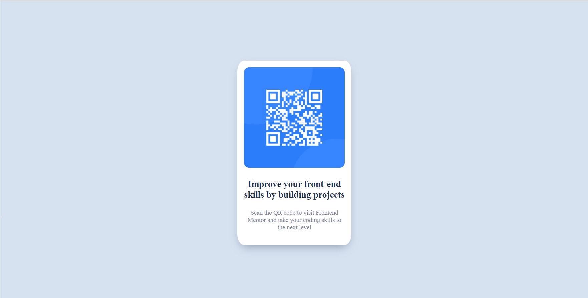

# Frontend Mentor - QR code component solution

This is a solution to the [QR code component challenge on Frontend Mentor](https://www.frontendmentor.io/challenges/qr-code-component-iux_sIO_H). Frontend Mentor challenges help you improve your coding skills by building realistic projects. 

## Table of contents
  - [Screenshot](#screenshot)
  - [Links](#links)

### Links

- Solution URL: [Solution](https://github.com/Ogbo0810/qr-code-component)
- Live Site URL: [Live Site](https://your-live-site-url.com)
